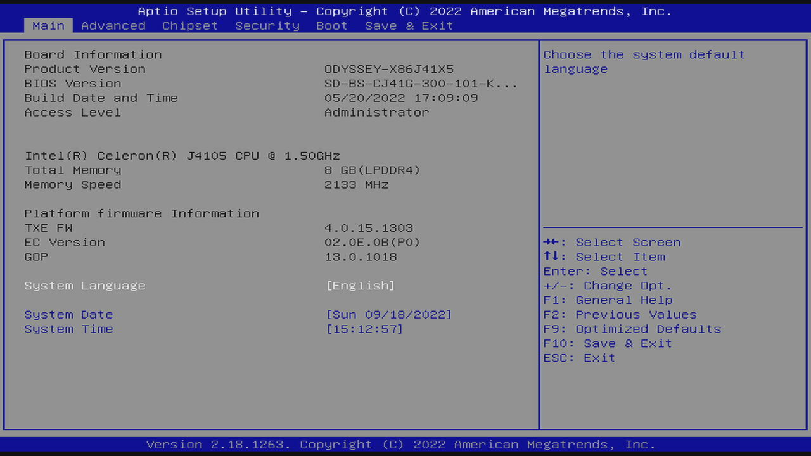

# Firmware

This board has several installable firmwares:

* [BIOS/UEFI](#biosuefi)
* [EC (Embedded Controller)](#ec-embedded-controller)
* ATSAMD21G18 (Seeeduino Zero Arduino Coprocessor)

Their versions appear in the BIOS main page:



I'm keeping the installation files that I've installed in my unit in this repository.

## BIOS/UEFI

See the [vendor upgrade instructions](https://wiki.seeedstudio.com/ODYSSEY-X86J4105-Installing-OS/#how-to-upgrade-the-bios).

| Date | Version | File | Checksum |
|------|---------|------|----------|
| 2021-08-16 | SD-BS-CJ41G-300-101-H | [SD-BS-CJ41G-300-101-H.zip](SD-BS-CJ41G-300-101-H.zip) | 9ea30178b4ef8453c6f24f037b4b3352ac6d214c7c22f94985428bcb23a178c2 |
| 2021-04-16 | SD-BS-CJ41G-300-101-F | [SD-BS-CJ41G-300-101-F.zip](SD-BS-CJ41G-300-101-F.zip) | 53711dbf9fb6abe564be1c7a870840f8b87caa42239448869d87c08c1bdf0ec5 |
| 2020-12-31 | SD-BS-CJ41G-M-101-K | [SD-BS-CJ41G-M-101-K.zip](SD-BS-CJ41G-M-101-K.zip) | 7208d39c4f77a4837a0a1072dce45c7bc8feba28597522ea036778a9c09aa61a |
| 2020-08-31 | SD-BS-CJ41G-M-101-G | [SD-BS-CJ41G-M-101-G.zip](SD-BS-CJ41G-M-101-G.zip) | eb932b69435d26a5b076c485c90e4289a697681ac092c18e85c86804e3fe4206 |

## EC (Embedded Controller)

See the [vendor upgrade instructions](https://wiki.seeedstudio.com/ODYSSEY-X86J4105-Installing-OS/#how-to-update-the-embedded-controller).

| Date | Version | File | Checksum |
|------|---------|------|----------|
| 2021-08-16 | 02.0B.09 | [SD-EC-CJ41G-M-101-O.zip](SD-EC-CJ41G-M-101-O.zip) | a08605b8b76bda6a50b64e64c4a9b256297d393f7139ffb2525cc93b28556f13 |
| 2021-04-16 | 02.09.09 | [SD-EC-CJ41G-M-101-M.zip](SD-EC-CJ41G-M-101-M.zip) | db6e1f77d6eb4b9a79ddaf6e7a55052b7be6e63b8339c7b948ff111e5c9ca8ad |
| 2021-02-02 | 02.09.06 | [SD-EC-CJ41G-M-101-J.zip](SD-EC-CJ41G-M-101-J.zip) | 4ab099f45439f8f6ec14e25ae50a64f878eed4c998e39000e17f2047df6bbb83 |
| 2020-08-31 | 02.05.03 | [SD-EC-CJ41G-M-101-C.zip](SD-EC-CJ41G-M-101-C.zip) | 4b7ed82357eb608c3ec00f6f5f0358a35e63b327ae33855eb5e7608814f8df6a |

# Firmware Update Usb Flash Device

You can create a firmware update usb flash device as:

```bash
# switch to root.
sudo bash

# find the pen device.
lsblk -o KNAME,SIZE,TRAN,FSTYPE,UUID,LABEL,MODEL,SERIAL
# lsblk should output all the plugged block devices, in my case, this is the device that I'm interested in:
#   sdg     14,5G usb                                                                STORAGE DEVICE   000000078
#   sdg1      91M        vfat     9349-0653                            ODYSSEYFW                                 

# set the pen target device and mount point.
target_device=/dev/sdg
target=/mnt/odysseyfw

# umount any existing partition that you might have already mounted.
umount ${target_device}?

# format the $target_device.
parted --script $target_device mklabel msdos
parted --script $target_device mkpart primary fat32 4 100
parted $target_device print
# parted print should output something like:
# Model: SanDisk Cruzer Blade (scsi)
# Disk /dev/sdg: 15,6GB
# Sector size (logical/physical): 512B/512B
# Partition Table: msdos
# Disk Flags: 

# Number  Start   End     Size    Type     File system  Flags
#  1      4194kB  99,6MB  95,4MB  primary               lba
mkfs -t vfat -n ODYSSEYFW ${target_device}1

# install the firmware in the targe device.
mkdir -p $target
mount ${target_device}1 $target
unzip SD-BS-CJ41G-300-101-H.zip -d $target
unzip SD-EC-CJ41G-M-101-O.zip -d $target

# check the results.
find $target

# eject the device.
umount $target
eject $target_device

# exit the root shell.
exit
```

You can now use the usb flash device to [install the BIOS firmware](https://wiki.seeedstudio.com/ODYSSEY-X86J4105-Installing-OS/#how-to-upgrade-the-bios) and then [install the EC firmware](https://wiki.seeedstudio.com/ODYSSEY-X86J4105-Installing-OS/#how-to-update-the-embedded-controller).
