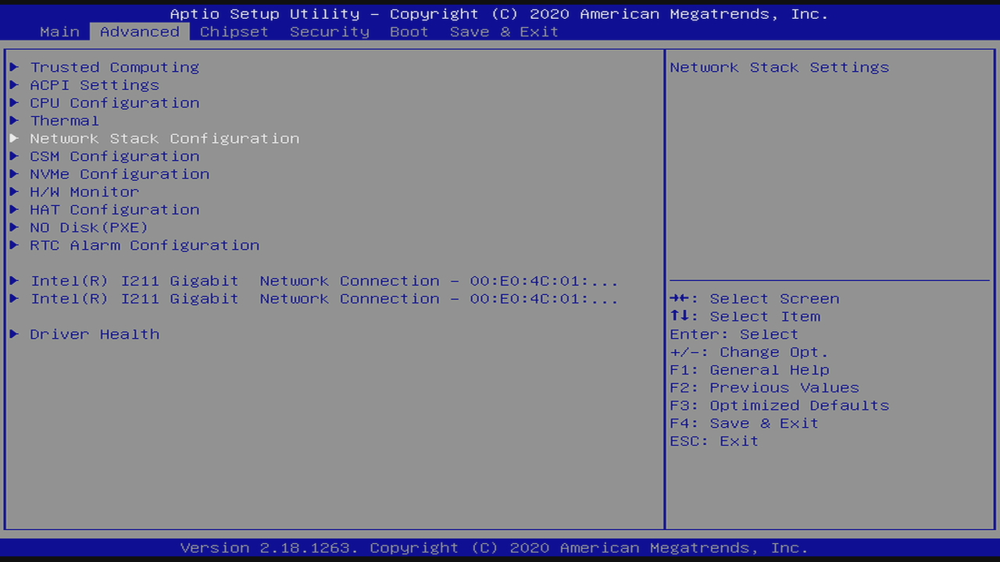
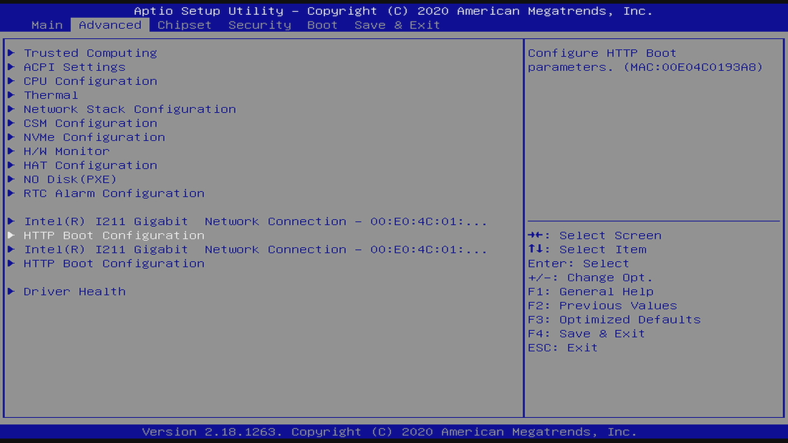
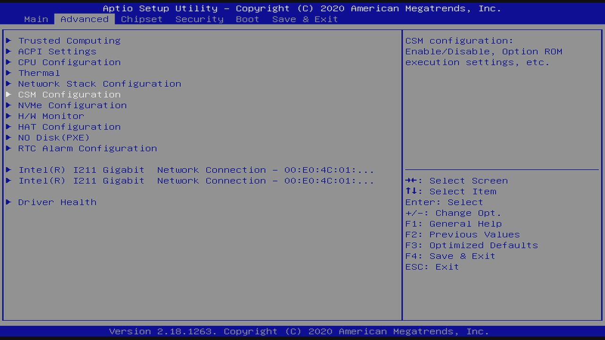

## Network Boot

This board supports two types of network booting protocols:

1. UEFI HTTP
2. Legacy PXE

### UEFI HTTP

Follow the steps:

1. Enter the firmware setup by pressing the `DEL` key.
2. Enter the `Advanced` tab by pressing the `RIGHT ARROW` key, then enter the `Network Stack Configuration` menu:

   <a href="firmware-network-boot-advanced.jpeg"></a>
3. Enable the `Network Stack` and `Ipv4 HTTP Support`:

   <a href="firmware-network-boot-protocols.jpeg"></a>
4. Go back to the `Advanced` tab by pressing the `ESC` key, then select the `NO Disk (PXE)` menu:

   <a href="firmware-network-boot-no-disk-pxe.jpeg"></a>
5. Enable the `UEFI PXE Boot` by selecting the `IPv4 Only` option:

   <a href="firmware-network-boot-enable-http-configuration.jpeg"></a>
6. Press the `F4` key to `Save & Exit` and let the system reboot.
7. Enter the firmware by pressing the `DEL` key.
8. Enter the `Advanced` tab and verify that you see two new `HTTP Boot Configuration` menu entries:

   <a href="firmware-network-boot-http-configuration-menu-entries.jpeg"></a>
9. Enter the `Boot` tab by pressing the `RIGHT ARROW` key, then disable all Boot Option Priorities except the `UEFI: HTTP IP4 Intel(R) I211 Gibabit Network Connection` option:

   <a href="firmware-network-boot-http-boot-option-priorities.jpeg"></a>
10. Press the `F4` key to `Save & Exit` and let the system reboot.
11. The system should now try to network boot by sending a DHCP Discover request alike:

	```
	Ethernet II, Src: RealtekS_01:93:a8 (00:e0:4c:01:93:a8), Dst: Broadcast (ff:ff:ff:ff:ff:ff)
	Internet Protocol Version 4, Src: 0.0.0.0, Dst: 255.255.255.255
		0100 .... = Version: 4
		.... 0101 = Header Length: 20 bytes (5)
		Differentiated Services Field: 0x00 (DSCP: CS0, ECN: Not-ECT)
			0000 00.. = Differentiated Services Codepoint: Default (0)
			.... ..00 = Explicit Congestion Notification: Not ECN-Capable Transport (0)
		Total Length: 368
		Identification: 0x5359 (21337)
		Flags: 0x0000
			0... .... .... .... = Reserved bit: Not set
			.0.. .... .... .... = Don't fragment: Not set
			..0. .... .... .... = More fragments: Not set
		Fragment offset: 0
		Time to live: 64
		Protocol: UDP (17)
		Header checksum: 0x2625 [validation disabled]
		[Header checksum status: Unverified]
		Source: 0.0.0.0
		Destination: 255.255.255.255
	User Datagram Protocol, Src Port: 68, Dst Port: 67
	Dynamic Host Configuration Protocol (Discover)
		Message type: Boot Request (1)
		Hardware type: Ethernet (0x01)
		Hardware address length: 6
		Hops: 0
		Transaction ID: 0xdc750a6c
		Seconds elapsed: 0
		Bootp flags: 0x8000, Broadcast flag (Broadcast)
			1... .... .... .... = Broadcast flag: Broadcast
			.000 0000 0000 0000 = Reserved flags: 0x0000
		Client IP address: 0.0.0.0
		Your (client) IP address: 0.0.0.0
		Next server IP address: 0.0.0.0
		Relay agent IP address: 0.0.0.0
		Client MAC address: RealtekS_01:93:a8 (00:e0:4c:01:93:a8)
		Client hardware address padding: 00000000000000000000
		Server host name not given
		Boot file name not given
		Magic cookie: DHCP
		Option: (53) DHCP Message Type (Discover)
			Length: 1
			DHCP: Discover (1)
		Option: (57) Maximum DHCP Message Size
			Length: 2
			Maximum DHCP Message Size: 65280
		Option: (55) Parameter Request List
			Length: 27
			Parameter Request List Item: (1) Subnet Mask
			Parameter Request List Item: (2) Time Offset
			Parameter Request List Item: (3) Router
			Parameter Request List Item: (4) Time Server
			Parameter Request List Item: (5) Name Server
			Parameter Request List Item: (6) Domain Name Server
			Parameter Request List Item: (12) Host Name
			Parameter Request List Item: (13) Boot File Size
			Parameter Request List Item: (15) Domain Name
			Parameter Request List Item: (17) Root Path
			Parameter Request List Item: (18) Extensions Path
			Parameter Request List Item: (22) Maximum Datagram Reassembly Size
			Parameter Request List Item: (23) Default IP Time-to-Live
			Parameter Request List Item: (28) Broadcast Address
			Parameter Request List Item: (40) Network Information Service Domain
			Parameter Request List Item: (41) Network Information Service Servers
			Parameter Request List Item: (42) Network Time Protocol Servers
			Parameter Request List Item: (43) Vendor-Specific Information
			Parameter Request List Item: (50) Requested IP Address
			Parameter Request List Item: (51) IP Address Lease Time
			Parameter Request List Item: (54) DHCP Server Identifier
			Parameter Request List Item: (58) Renewal Time Value
			Parameter Request List Item: (59) Rebinding Time Value
			Parameter Request List Item: (60) Vendor class identifier
			Parameter Request List Item: (161) Manufacturer Usage Description
			Parameter Request List Item: (67) Bootfile name
			Parameter Request List Item: (97) UUID/GUID-based Client Identifier
		Option: (97) UUID/GUID-based Client Identifier
			Length: 17
			Client Identifier (UUID): 03000200-0400-0500-0006-000700080009
		Option: (94) Client Network Device Interface
			Length: 3
			Major Version: 3
			Minor Version: 16
		Option: (93) Client System Architecture
			Length: 2
			Client System Architecture: x64 UEFI HTTP (16)
		Option: (60) Vendor class identifier
			Length: 33
			Vendor class identifier: HTTPClient:Arch:00016:UNDI:003016
		Option: (255) End
			Option End: 255
	```

### Legacy PXE

Follow the steps:

1. Enter the firmware setup by pressing the `DEL` key.
2. Enter the `Advanced` tab menu by pressing the `RIGHT ARROW` key, then select the `CSM Configuration` menu:

   <a href="firmware-network-boot-csm-menu-selected.jpeg"></a>
3. Enable the `CSM Support` and configure the other options as:

   <a href="firmware-network-boot-csm-configuration.jpeg"></a>
4. Go back to the `Advanced` tab menu by pressing the `ESC` key, then select the `NO Disk (PXE)` menu:

   <a href="firmware-network-boot-no-disk-pxe.jpeg"></a>
5. Enable the `Legacy PXE Boot`:

   <a href="firmware-network-boot-enable-legacy-pxe-configuration.jpeg"></a>
6. Press the `F4` key to `Save & Exit` and let the system reboot.
7. Enter the firmware by pressing the `DEL` key.
8. Enter the `Boot` tab by pressing the `RIGHT ARROW` key, then disable all Boot Option Priorities except the `IBA GE Slot 0200 v1562` option:

   <a href="firmware-network-boot-legacy-pxe-boot-option-priorities.jpeg"></a>
10. Press the `F4` key to `Save & Exit` and let the system reboot.
11. The system should now try to network boot by sending a DHCP Discover request alike:

	```
	Ethernet II, Src: RealtekS_01:93:a8 (00:e0:4c:01:93:a8), Dst: Broadcast (ff:ff:ff:ff:ff:ff)
	Internet Protocol Version 4, Src: 0.0.0.0, Dst: 255.255.255.255
		0100 .... = Version: 4
		.... 0101 = Header Length: 20 bytes (5)
		Differentiated Services Field: 0x00 (DSCP: CS0, ECN: Not-ECT)
			0000 00.. = Differentiated Services Codepoint: Default (0)
			.... ..00 = Explicit Congestion Notification: Not ECN-Capable Transport (0)
		Total Length: 576
		Identification: 0x0000 (0)
		Flags: 0x0000
			0... .... .... .... = Reserved bit: Not set
			.0.. .... .... .... = Don't fragment: Not set
			..0. .... .... .... = More fragments: Not set
		Fragment offset: 0
		Time to live: 20
		Protocol: UDP (17)
		Header checksum: 0xa4ae [validation disabled]
		[Header checksum status: Unverified]
		Source: 0.0.0.0
		Destination: 255.255.255.255
	User Datagram Protocol, Src Port: 68, Dst Port: 67
	Dynamic Host Configuration Protocol (Discover)
		Message type: Boot Request (1)
		Hardware type: Ethernet (0x01)
		Hardware address length: 6
		Hops: 0
		Transaction ID: 0x4c0193a8
		Seconds elapsed: 0
		Bootp flags: 0x8000, Broadcast flag (Broadcast)
			1... .... .... .... = Broadcast flag: Broadcast
			.000 0000 0000 0000 = Reserved flags: 0x0000
		Client IP address: 0.0.0.0
		Your (client) IP address: 0.0.0.0
		Next server IP address: 0.0.0.0
		Relay agent IP address: 0.0.0.0
		Client MAC address: RealtekS_01:93:a8 (00:e0:4c:01:93:a8)
		Client hardware address padding: 00000000000000000000
		Server host name not given
		Boot file name not given
		Magic cookie: DHCP
		Option: (53) DHCP Message Type (Discover)
			Length: 1
			DHCP: Discover (1)
		Option: (55) Parameter Request List
			Length: 36
			Parameter Request List Item: (1) Subnet Mask
			Parameter Request List Item: (2) Time Offset
			Parameter Request List Item: (3) Router
			Parameter Request List Item: (4) Time Server
			Parameter Request List Item: (5) Name Server
			Parameter Request List Item: (6) Domain Name Server
			Parameter Request List Item: (11) Resource Location Server
			Parameter Request List Item: (12) Host Name
			Parameter Request List Item: (13) Boot File Size
			Parameter Request List Item: (15) Domain Name
			Parameter Request List Item: (16) Swap Server
			Parameter Request List Item: (17) Root Path
			Parameter Request List Item: (18) Extensions Path
			Parameter Request List Item: (22) Maximum Datagram Reassembly Size
			Parameter Request List Item: (23) Default IP Time-to-Live
			Parameter Request List Item: (28) Broadcast Address
			Parameter Request List Item: (40) Network Information Service Domain
			Parameter Request List Item: (41) Network Information Service Servers
			Parameter Request List Item: (42) Network Time Protocol Servers
			Parameter Request List Item: (43) Vendor-Specific Information
			Parameter Request List Item: (50) Requested IP Address
			Parameter Request List Item: (51) IP Address Lease Time
			Parameter Request List Item: (54) DHCP Server Identifier
			Parameter Request List Item: (58) Renewal Time Value
			Parameter Request List Item: (59) Rebinding Time Value
			Parameter Request List Item: (60) Vendor class identifier
			Parameter Request List Item: (66) TFTP Server Name
			Parameter Request List Item: (67) Bootfile name
			Parameter Request List Item: (128) DOCSIS full security server IP [TODO]
			Parameter Request List Item: (129) PXE - undefined (vendor specific)
			Parameter Request List Item: (130) PXE - undefined (vendor specific)
			Parameter Request List Item: (131) PXE - undefined (vendor specific)
			Parameter Request List Item: (132) PXE - undefined (vendor specific)
			Parameter Request List Item: (133) PXE - undefined (vendor specific)
			Parameter Request List Item: (134) PXE - undefined (vendor specific)
			Parameter Request List Item: (135) PXE - undefined (vendor specific)
		Option: (57) Maximum DHCP Message Size
			Length: 2
			Maximum DHCP Message Size: 1260
		Option: (97) UUID/GUID-based Client Identifier
			Length: 17
			Client Identifier (UUID): 03000200-0400-0500-0006-000700080009
		Option: (93) Client System Architecture
			Length: 2
			Client System Architecture: IA x86 PC (0)
		Option: (94) Client Network Device Interface
			Length: 3
			Major Version: 2
			Minor Version: 1
		Option: (60) Vendor class identifier
			Length: 32
			Vendor class identifier: PXEClient:Arch:00000:UNDI:002001
		Option: (255) End
			Option End: 255
		Padding: 000000000000000000000000000000000000000000000000
	```
